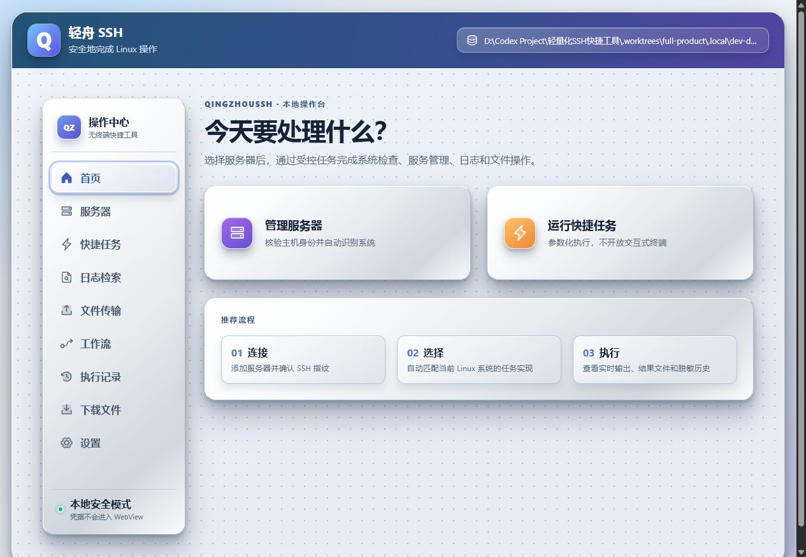
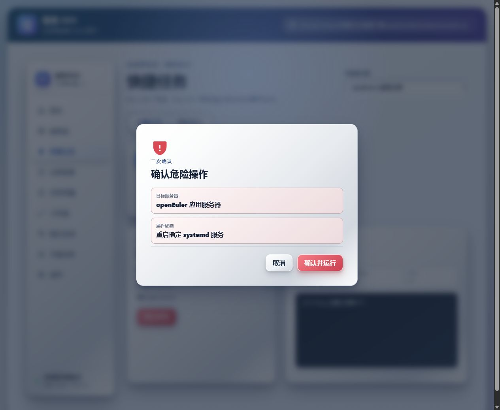
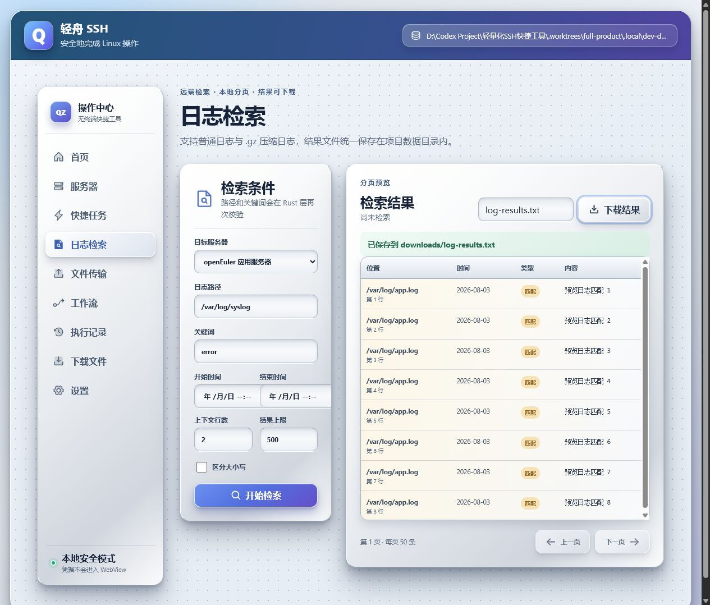
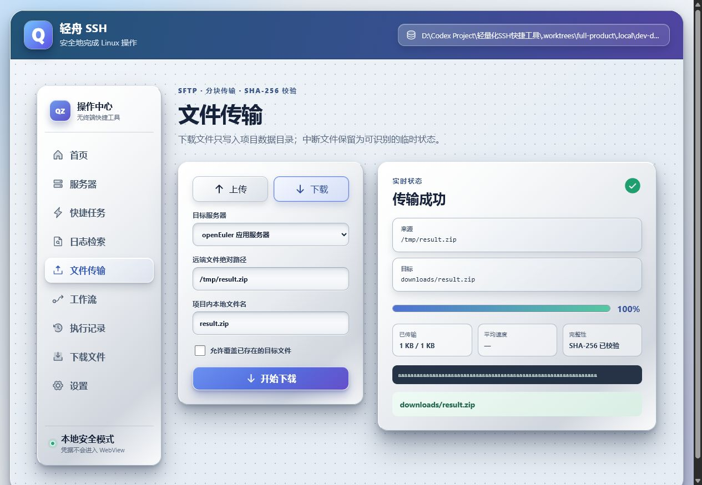
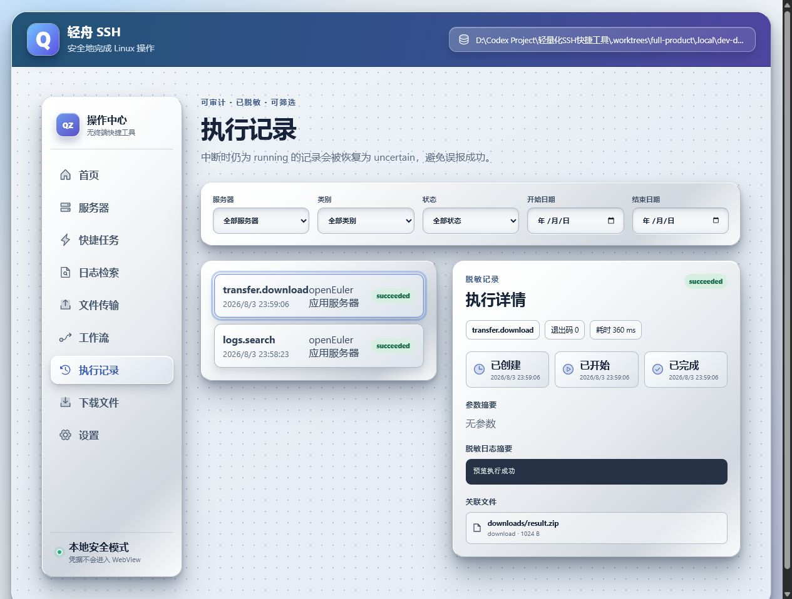

# Milestone 2 验收记录

验收范围：快捷任务、受控命令/脚本、日志检索与下载、SFTP 文件传输、执行历史和项目内数据约束。

## 支持范围

- 系统自动识别：Ubuntu/Debian、RHEL/Rocky/Anolis、openEuler、银河麒麟和 UOS；任务实现再根据 `systemd`、`service`、`grep`、`gzip` 等能力自动匹配。
- 内置任务：系统概览、磁盘使用、进程查询、服务状态、服务启动、服务停止、服务重启和日志检索。
- 高级执行：受控单条命令或多行 `sh -s` 脚本；无 PTY、无交互式终端、无持续 stdin。
- 日志：远端绝对 `.log`/`.gz` 路径，关键词最长 512 字节，上下文 0–20 行，结果 1–10,000 条，界面每页 50 条，下载写入数据根目录下的 `downloads`。
- 传输：64 KiB SFTP 分块、进度事件、`.partial` 临时文件、SHA-256 校验；下载目标限制在数据根目录下的 `downloads`。
- 输出：单事件最多 32 KiB，单次执行最多 32 MiB，历史摘要最多 8 KiB；凭据、私钥和敏感参数统一脱敏。

## 安全与恢复语义

- 服务启动、停止、重启和所有高级执行均要求二次确认；确认弹窗只显示目标与影响摘要。
- `cancelled` 只用于已经确认本地通道终止的执行；无法确认远端终止时记录为 `uncertain`。
- 应用启动会把遗留 `running` 记录恢复为 `uncertain`，不会把中断任务伪装成成功。
- WebView 只展示后端登记的相对文件路径，不扫描任意磁盘；开发运行数据位于项目目录内的 `.local\dev-data`。

## 真实联调

执行命令：

```powershell
.\scripts\test-ssh-live.ps1 -SkipPythonDependencyInstall
```

结果：`ssh_live` 3/3、`sftp_live` 1/1、`m2_live` 1/1 全部通过。`m2_live` 覆盖内置系统/服务任务、高级命令/脚本、普通与 gzip 日志检索下载、SFTP 往返、执行历史以及 SQLite/日志/事件/文件凭据 canary 扫描。夹具在结束时自动停止，全部夹具数据位于项目目录内 `.local`。

夹具生命周期检查：

```powershell
powershell -NoProfile -ExecutionPolicy Bypass -File .\scripts\tests\ssh-fixture.tests.ps1
```

结果：重复停止、启动、状态查询、日志与可写目录准备、结束清理均通过。

## 界面人工验收

通过内置浏览器实际点击验收：首页、服务器选择、任务参数表单、危险任务二次确认、高级执行非交互提示、日志检索分页与下载反馈、SFTP 下载进度与 SHA-256 状态、执行历史筛选/详情、下载文件清单。白银渐变、边缘高光、三层阴影、文字对比度和左右面板背景一致性符合已确认方案。












## 自动化门禁

以下门禁全部通过：

- `scripts/tests/dev-env.tests.ps1`：全部可控开发路径位于当前项目内。
- `scripts/verify-d-drive.ps1`：开发和应用路径均位于 D 盘项目目录内。
- `pnpm test`：14 个测试文件、28 个测试全部通过。
- `pnpm build`：TypeScript 与 Vite 生产构建通过。
- `cargo fmt -- --check`：通过。
- `cargo clippy --locked --all-targets -- -D warnings`：零警告通过。
- `cargo test --locked --all-targets -- --nocapture`：53 个非 live 测试通过，5 个 live 测试按设计保持 ignored；live 测试已由上文夹具命令单独全部执行。
- `pnpm tauri build --debug --no-bundle`：调试可执行文件构建成功，产物位于项目内 `target\debug\qingzhou-ssh.exe`。
- 占位扫描只命中两个真实 HTML 表单 `placeholder` 属性和计划文档中的扫描命令本身；未发现 TODO、伪成功或 M2 待实现逻辑。
- 精确检查 C 盘 AppData、`D:\` 与 `D:\Codex Project` 根目录后，未发现项目生成的缓存、target、SQLite、日志、下载或更新目录。

审计过程中识别出旧版曾把注册表 `DataRoot` 错设为 `D:\`，并在 D 盘根目录留下 `app.db`、`vault`、`logs`、`downloads`、`backups`、`templates`、`cache` 和 `updates`。这些数据（包括加密凭据文件）已原样迁移到 `D:\Codex Project\轻量化SSH快捷工具\data`，注册表配置已同步更新，D 盘根目录旧路径已全部清除。

## 后续边界

M3 可视化工作流和 M4 安装包/在线更新/GitHub Releases + ModelScope 双源发布尚未开发完成；工作流页面只显示里程碑说明，没有伪运行能力。
